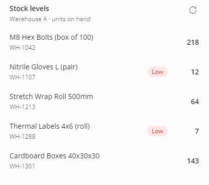
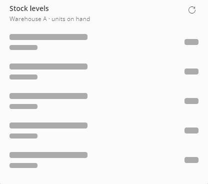
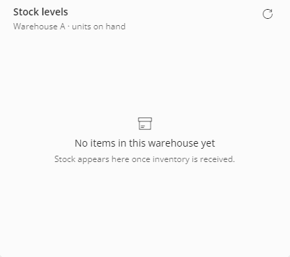
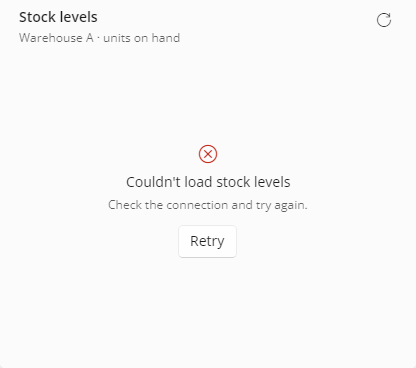

# ComponentStatesLab

Test harness and eval fixtures for the `uno-component-states` agent skill, which adds Loading, Empty and Error states to a populated Uno Platform component while keeping its shell (size, padding, tokens) unchanged. Each project is a small Uno app with a data-only component and a service whose responses can be forced into `slow`, `empty` or `error` at runtime.

| Data | Loading | Empty | Error |
|---|---|---|---|
|  |  |  |  |

## Projects

| Project | Stack | Purpose |
|---|---|---|
| `ComponentStatesLab/` | MVUX, Material, Toolkit | Original harness. `MainPage` has a FeedView account header as the "house pattern" plus three targets (metric `Card`, sector `ChipGroup`, holdings list); `BarePage` has a hand-built signal widget with no state mechanism. `LAB_MODE` env var picks the mode |
| `ProductCardAppv2/` | MVUX, SimpleTheme, Toolkit | Product card whose states were generated by another tool; the reference failure case |
| `FluentStatesProbe/` | Plain MVVM (INPC), Fluent | Recent Orders card with flag-bound visibility |
| `StationBoardLab/` | Plain MVVM, custom tokens | `DepartureBoard` `UserControl` with its own design system and a Refresh button |
| `PartsFinderLab/` | Plain MVVM, Fluent | A page with four regions, two of which should get no states |
| `InventoryCardLab/` | MVUX, Fluent | Stock levels card, built from nothing and then given states |
| `PulseCpuRepro/` | Plain Uno | Isolated repro of storyboard CPU use when the target is hidden but the animation keeps running |

Other folders:

- `docs/eval-fixtures.md`: how to run a fixture and the grading checklist (static and runtime)
- `docs/uno-studio-states-rules-card.md`: condensed rules from the skill for one-shot generation agents
- `docs/skill-trial-report.html`: write-up of five trial runs and their results
- `tools/`: Windows PowerShell scripts to launch a lab under a mode, capture the window, and compose a 2x2 state sheet

## Tech

- Uno Platform single projects, Skia renderer, .NET 10
- `Uno.Sdk` 6.8.0-dev.12 for every project except `ProductCardAppv2` (6.7.0-dev.105); each fixture has its own `global.json` and `.sln`
- `ComponentStatesLab` targets `net10.0-desktop` only; the others list android, ios, browserwasm and desktop
- The fixture services (except `ComponentStatesLab`, which uses `LAB_MODE`) re-read a mode file on every call and append to a trace log, so Retry can be verified by flipping the mode while the app runs. Most mode files live in `%TEMP%`; `InventoryCardLab` reads `.states/mode.txt` beside its `.sln`

## Run it

Requires the .NET 10 SDK. From the repo root:

```
dotnet build ComponentStatesLab.sln -c Release
dotnet run --project ComponentStatesLab/ComponentStatesLab.csproj -f net10.0-desktop
```

A fixture builds from its own folder, for example:

```
dotnet run --project FluentStatesProbe/FluentStatesProbe/FluentStatesProbe.csproj -f net10.0-desktop
```

On Windows, `tools/Run-Lab.ps1 -Mode <data|slow|empty|error> -OutputPath <png>` launches the Release build of `ComponentStatesLab` under a mode and captures it.

## Status

Trial complete: the report covers five runs (one control, four with the skill). Two framework issues found during the trial were filed upstream (per the last commit message). `HANDOFF.md` predates the runs.
